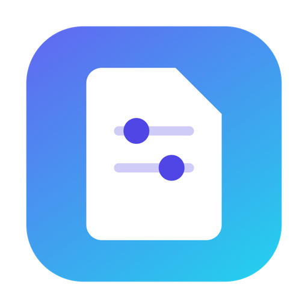
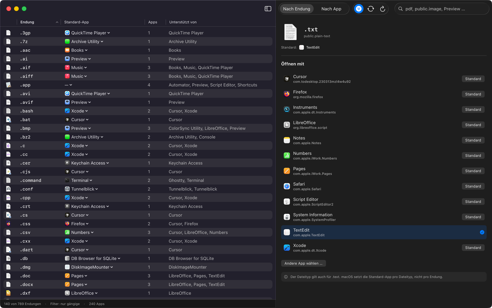

<p align="center">
  
</p>

<h1 align="center">ExtControl</h1>

<p align="center">
  
  
  
</p>

Standard-Apps für Dateiendungen auf macOS verwalten — in einer Liste statt einzeln über
den Finder-Infodialog.

macOS bietet keine zentrale Stelle, an der man sieht, welche App welche Dateiendung
öffnet. ExtControl scannt alle installierten Apps, dreht deren `CFBundleDocumentTypes`
um und zeigt pro Endung die aktuell zuständige App — änderbar per Klick, auch für
viele Endungen gleichzeitig.

<p align="center">
  
</p>

## Features

- **Endungs-Ansicht** — Tabelle aller gefundenen Dateiendungen mit aktueller Standard-App
- **Standard-App per Menü setzen** — direkt in der Tabellenzeile oder im Detailbereich
- **Mehrfachauswahl** — mehrere Endungen markieren, per Rechtsklick eine App für alle setzen
- **Filter „Nur gängige"** — kuratierte Liste (~230 Endungen) an/aus schalten
- **App-Ansicht** — umgekehrter Blick: eine App als Standard für *all* ihre Endungen setzen
- **Suche & Sortierung** — Live-Suche über Endung, UTI und App-Name; alle Spalten sortierbar
- **Beliebige App wählen** — Datei-Dialog für Apps, die die Endung nicht deklarieren

## Installation

### Fertiges DMG

Neuestes `ExtControl-x.y.dmg` unter [Releases](../../releases) laden, öffnen und
ExtControl in den Ordner *Programme* ziehen.

Die App ist nur ad-hoc signiert (kein Apple Developer Account). Beim ersten Start
meldet Gatekeeper „nicht verifizierter Entwickler". Entweder Rechtsklick auf die App
-> **Öffnen** -> **Öffnen**, oder einmalig:

```bash
xattr -dr com.apple.quarantine /Applications/ExtControl.app
```

### Selbst bauen

```bash
git clone https://github.com/<user>/ExtControl.git
cd ExtControl
./build_app.sh          # -> dist/ExtControl.app
open dist/ExtControl.app

./make_dmg.sh 1.0       # -> dist/ExtControl-1.0.dmg (gestaltetes Fenster)
```

Oder direkt starten:

```bash
swift run -c release
```

Voraussetzungen: macOS 13+, Xcode Command Line Tools (Swift 5.9).

### Release veröffentlichen

Tag pushen — GitHub Actions (`.github/workflows/release.yml`) baut das DMG auf einem
macOS-Runner und hängt es an den Release:

```bash
git tag v1.0
git push origin v1.0
```

Manuell geht auch:

```bash
./make_dmg.sh 1.0
gh release create v1.0 dist/ExtControl-1.0.dmg --title "ExtControl 1.0" --generate-notes
```

## Bedienung

| Aktion | Weg |
|---|---|
| Standard-App ändern | Klick auf App-Namen in Spalte **Standard-App** -> App wählen |
| Andere App wählen | Menü -> „Andere App wählen …" (Datei-Dialog) |
| Mehrere Endungen | Zeilen mit ⌘/⇧ markieren -> Rechtsklick -> „Standard-App für n Endung(en)" |
| Alle Endungen einer App | Ansicht **Nach App** -> Rechtsklick auf App |
| Filter umschalten | Toolbar-Button **Nur gängige** |
| Neu scannen | ⌘R |

## Wie es funktioniert

- **Scan:** parallele Suche (`TaskGroup`) nach `.app`-Bundles in `/Applications`,
  `/System/Applications`, `~/Applications`, `/System/Library/CoreServices` u. a.,
  plus laufende Apps über `NSWorkspace`
- **Endungen:** aus `CFBundleTypeExtensions` **und** aus `LSItemContentTypes`
  (UTI -> `UTType.tags[.filenameExtension]`)
- **Lesen:** `NSWorkspace.urlForApplication(toOpen:)` / `urlsForApplications(toOpen:)`
- **Schreiben:** `NSWorkspace.setDefaultApplication(at:toOpen:)` (macOS 15+),
  sonst `LSSetDefaultRoleHandlerForContentType`

## Wichtig zu wissen

macOS speichert Standard-Apps **pro Dateityp (UTI), nicht pro Endung**. Teilen sich
mehrere Endungen einen UTI (`.jpg` und `.jpeg` -> `public.jpeg`), gilt eine Änderung
für alle. Der Detailbereich weist auf betroffene Endungen hin.

Endungen ohne registrierten UTI bekommen von macOS einen dynamischen UTI
(`dyn.ah62d…`). Dort kann LaunchServices die Zuordnung ablehnen — Fehler erscheinen
als Dialog.

`LSDatabaseQuery` (vollständiger LaunchServices-Dump) ist private API und wird nicht
genutzt; ExtControl arbeitet mit Verzeichnis-Scan und öffentlichen APIs.

## Projektstruktur

| Datei | Zweck |
|---|---|
| `Model/AppExtensionModel.swift` | App + `CFBundleDocumentTypes` |
| `Model/FileExtensionModel.swift` | Endung -> UTIs + unterstützende Apps |
| `Model/CommonExtensions.swift` | Kuratierte Liste gängiger Endungen |
| `Services/AppScanner.swift` | Bundle-Scan, Info.plist-Parsing, `buildExtensionIndex` |
| `Services/DefaultAppService.swift` | LaunchServices: Handler lesen/setzen |
| `Services/AppStore.swift` | Ladezustand, Endungs-Index, Handler-Cache, Icon-Cache |
| `Views/ContentView.swift` | Modus-Umschalter + App-Tabelle |
| `Views/ExtensionListView.swift` | Endungs-Tabelle mit Inline-Menü |
| `Views/ExtensionDetailView.swift` | Detail: Kandidaten-Apps, Standard setzen |
| `Views/AppDetailView.swift` | Detail der App-Ansicht |
| `build_app.sh` | Baut `dist/ExtControl.app` inkl. Info.plist und Icon |
| `make_dmg.sh` | Baut die App und packt sie als DMG |
| `tools/MakeIcon.swift` | Rendert das App-Icon (`Resources/AppIcon.iconset`) |
| `tools/MakeDMGBackground.swift` | Rendert den DMG-Hintergrund (TIFF, 1x + 2x) |
| `Resources/dmg-DS_Store` | Gesichertes DMG-Fensterlayout für CI-Builds |
| `docs/` | Icon und Screenshot für die README |

## DMG-Layout

`make_dmg.sh` baut ein DMG mit Hintergrundbild, festen Icon-Positionen (App links,
`/Applications`-Symlink rechts, Pfeil dazwischen), ausgeblendeter Toolbar und
Volume-Icon.

Ablauf: App bauen -> Staging-Ordner -> beschreibbares UDRW-Image -> Finder per
AppleScript einrichten -> Layout als `.DS_Store` sichern -> nach UDZO komprimieren.

- Beim ersten Lauf fragt macOS nach der Berechtigung, den **Finder** zu steuern
  (Systemeinstellungen -> Datenschutz -> Automation).
- Auf CI (`$CI` gesetzt) oder mit `NO_FINDER=1` wird das eingecheckte
  `Resources/dmg-DS_Store` verwendet, statt den Finder zu steuern — GitHub-Runner
  haben keine nutzbare Finder-Session.
- Positionen und Fenstergröße stehen als Variablen oben in `make_dmg.sh`; das
  Hintergrundbild wird von `tools/MakeDMGBackground.swift` gerendert
  (Multi-Resolution-TIFF, 1x + 2x).

```bash
swift tools/MakeDMGBackground.swift Resources/dmg-background.tiff
./make_dmg.sh 1.0
```

## Icon neu bauen

```bash
swift tools/MakeIcon.swift Resources/AppIcon.iconset
iconutil -c icns Resources/AppIcon.iconset -o Resources/AppIcon.icns
./build_app.sh
```

## Lizenz

MIT © 2026 Robin Ahn
